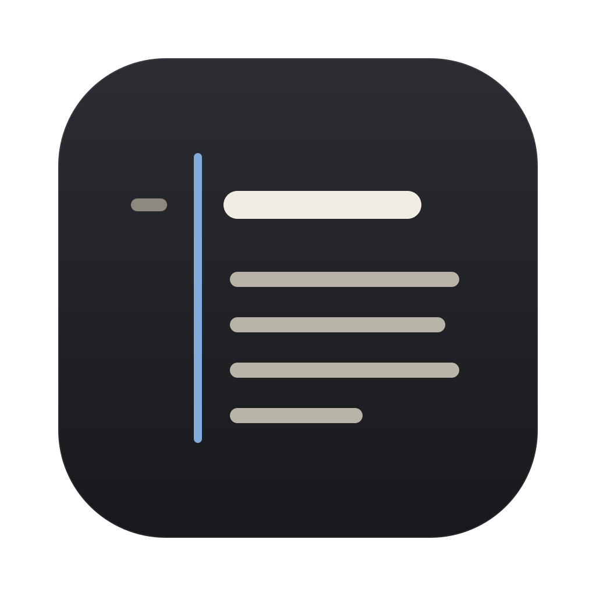
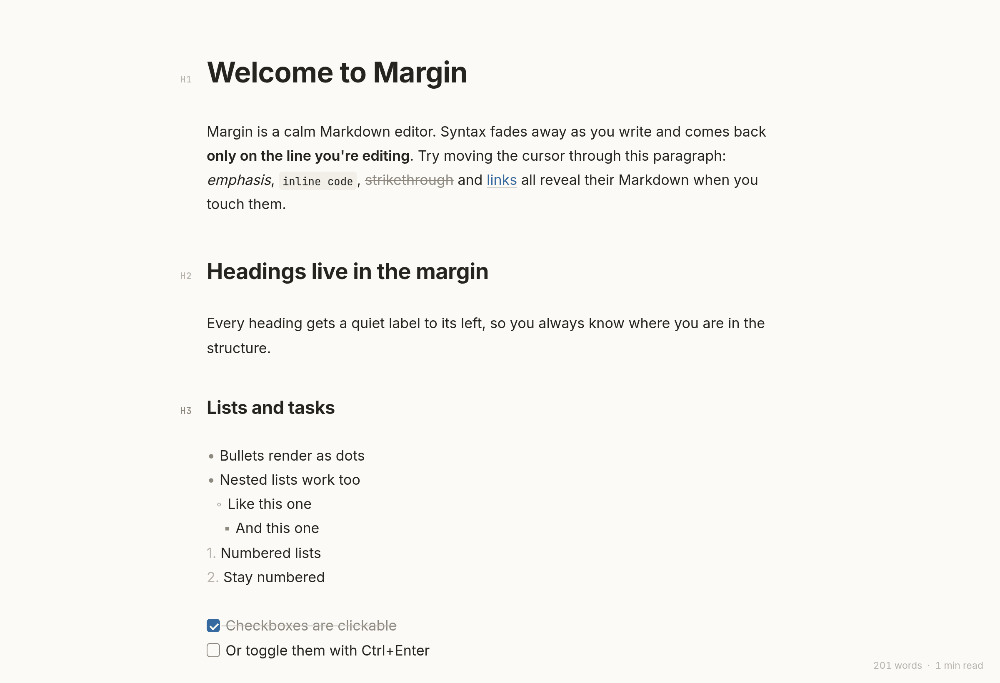
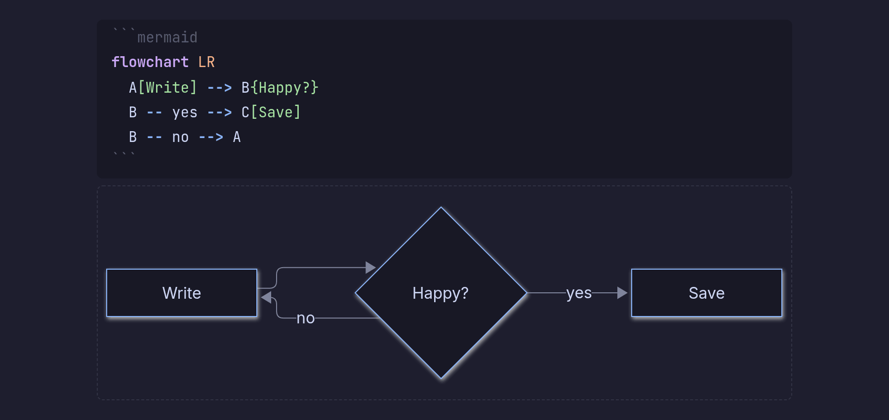
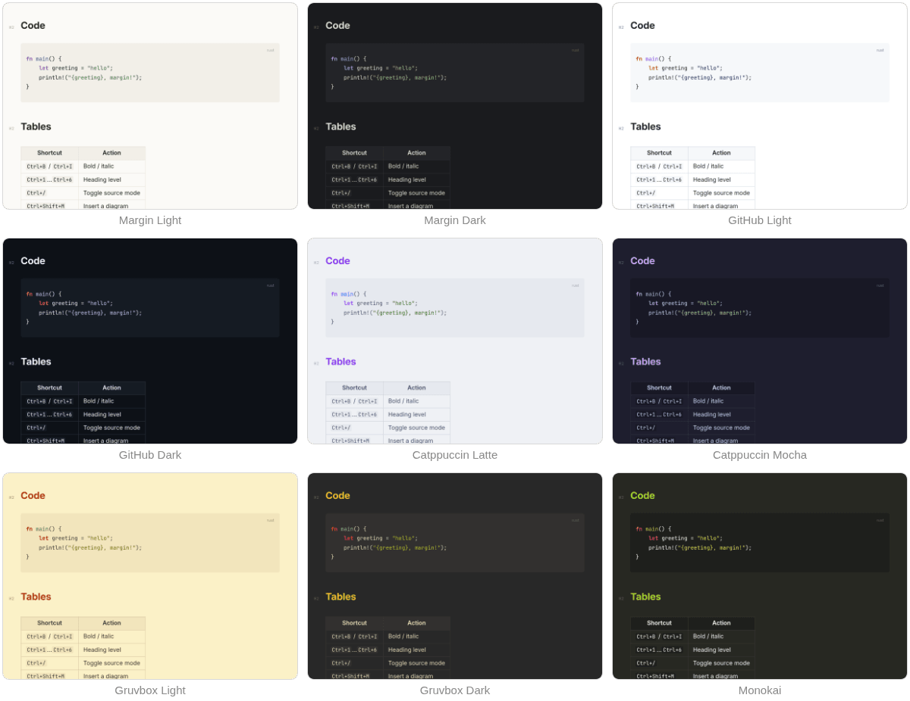
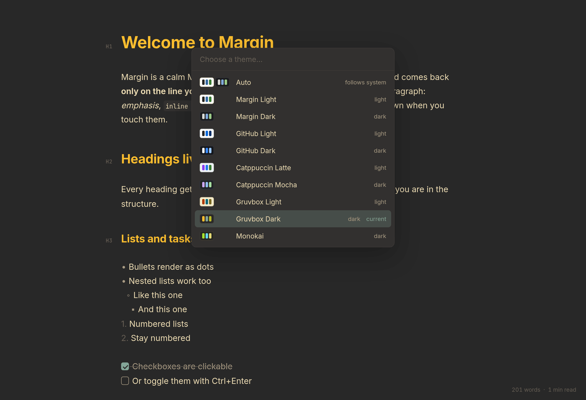

<p align="center">
  
</p>

<h1 align="center">Margin</h1>

<p align="center">A calm, keyboard-first Markdown editor for the desktop, inspired by Typora.</p>

<p align="center">
  <picture>
    <source media="(prefers-color-scheme: dark)" srcset="docs/screenshots/hero-dark.png">
    
  </picture>
</p>

Markdown syntax fades away as you write and reappears only where your cursor is. Headings get a quiet level label (H1–H6) in the left margin. Mermaid diagrams, tables, images and task lists render inline.

Built with [Tauri 2](https://tauri.app). A small Rust backend handles files and the window, and a [CodeMirror 6](https://codemirror.net) front end does the editing.

### Diagrams that stay editable

Mermaid code blocks render as diagrams. Click into one, or arrow into it, to edit the source with syntax highlighting while a live preview updates underneath.

<p align="center">
  
</p>

## Install (Linux)

```sh
./install.sh              # build a release and install for your user
./install.sh --default    # …and make Margin the default app for .md files
./install.sh --uninstall  # remove it again
```

This puts `margin` in `~/.local/bin` and adds a launcher entry and icon. You can then open Margin from your app launcher, run `margin notes.md` from a terminal, or right-click a `.md` file and open it with Margin. To update later, pull the latest code and run `./install.sh` again.

## Install (macOS and Windows)

Download the installer from the [latest release](https://github.com/MaxAnderberg/margin/releases/latest): a universal `.dmg` for macOS (Apple Silicon and Intel), or an `.msi`/`.exe` for Windows. The apps aren't code-signed, so the first launch needs one extra click:

- **macOS:** right-click Margin in Applications → **Open** → **Open**.
- **Windows:** when SmartScreen appears, click **More info** → **Run anyway**.

You can also build from source on those systems with `npm run tauri build` (see below).

## Develop

Requirements: Rust (stable), Node 20+, and on Linux `webkit2gtk-4.1`.

```sh
npm install
npm run tauri dev                                    # dev mode, hot reload
npm run tauri dev -- -- -- "$PWD/path/to/file.md"    # open a specific file
npm run tauri build                                  # release binary + packages in src-tauri/target/release
```

In dev mode the app runs from `src-tauri/`, so pass an absolute path. The three `--` get the file past npm, the Tauri CLI and cargo to the app itself.

`margin notes.md` opens (or starts) that file. With no argument, Margin reopens the last file.

### Tests

```sh
npm run check                          # type-check + unit and pipeline tests (Vitest, ~1 s)
npx playwright test                    # browser tests against the dev server
npx playwright test --project=chromium # …Chromium only (WebKit needs Ubuntu/Debian libraries)
cd src-tauri && cargo test             # Rust: saving, conflicts, permissions, symlinks, folder listing
```

| Folder | What it covers |
| --- | --- |
| `tests/unit/` | Live preview (what's hidden where), formatting commands, Mermaid highlighting, paths, quick open matching, theme colors and contrast |
| `tests/release/` | The release pipeline: matching version numbers, release-please settings, and how the workflows fit together |
| `tests/e2e/` | The app in a real browser, with a simulated disk in place of the Rust backend: rendering, diagrams, shortcuts, autosave, conflicts, drafts, every theme, the theme picker, quick open |

CI (`.github/workflows/ci.yml`) runs all of these on every pull request, plus `cargo fmt`, `clippy` and [actionlint](https://github.com/rhysd/actionlint) for the workflow files. The browser tests run in both Chromium and WebKit, the engine Margin uses on Linux and macOS. The first time you run them, use `npx playwright install chromium webkit`.

## Keyboard

| Keys | Action |
| --- | --- |
| `Ctrl+N` / `Ctrl+O` | New / open |
| `Ctrl+P` | Quick open: recent files and Markdown files in this folder |
| `Ctrl+S` / `Ctrl+Shift+S` | Save / save as |
| `Ctrl+B` / `Ctrl+I` / `Ctrl+E` | Bold / italic / inline code |
| `Ctrl+Shift+X` | Strikethrough |
| `Ctrl+K` | Link |
| `Ctrl+1` … `Ctrl+6`, `Ctrl+0` | Heading level / paragraph |
| `Ctrl+Enter` | Toggle task checkbox |
| `Ctrl+Shift+K` | Code block |
| `Ctrl+Shift+M` | Mermaid diagram |
| `Ctrl+F` | Find / replace |
| `Ctrl+/` | Toggle source mode (raw Markdown) |
| `Ctrl+Shift+L` | Choose a theme (arrows preview live, `Enter` keeps, `Esc` reverts) |
| `Ctrl+=` / `Ctrl+-` / `Ctrl+Shift+0` | Zoom in / out / reset |
| `F11` | Full screen |
| `Ctrl+click` | Open link |

You can also drop a `.md` file onto the window to open it.

### Quick open

Press `Ctrl+P` and type a few letters of a file name to switch to it. The list holds the files you opened recently, newest first, and the Markdown files in the open file's folder and its subfolders. Letters only need to appear in order, so `qkop` finds `quick-open.md`. Hidden folders and `node_modules` are skipped.

## Themes

Margin Light and Dark, GitHub Light and Dark, Catppuccin Latte and Mocha, Gruvbox Light and Dark, and Monokai. There is also **Auto**, which follows your system's light/dark setting. Mermaid diagrams take on each theme's colors. Themes are plain color sets in `src/themes.ts`, so adding one is a single entry.

<p align="center">
  
</p>

Press `Ctrl+Shift+L` to open the picker. Arrow keys preview each theme live and typing filters the list.

<p align="center">
  
</p>

## Saving

- **Autosave:** files save automatically about a second after you stop typing, and when you switch away from the window. `Ctrl+S` still works.
- **Untitled documents** are kept as a recovery draft and come back the next time you open Margin.
- **Changes made elsewhere:** if the file changes in another program and you have no unsaved edits, Margin reloads it when you return to the window. If you do have unsaved edits, Margin asks whether to keep your version or load the one on disk. Loading from disk is undoable with `Ctrl+Z`.
- Saves are atomic (temp file + rename), keep the file's permissions, and write through symlinks.

## Layout

```
src-tauri/src/lib.rs        Rust: file read, conflict-checked atomic write, folder listing, CLI argument (tests: cargo test)
src/main.ts                 App wiring: files, shortcuts, theme, title
src/editor/livePreview.ts   Hides syntax and renders widgets away from the cursor
src/editor/commands.ts      Formatting commands
src/editor/mermaid.ts       Lazy, cached Mermaid rendering in the theme's colors
src/editor/mermaidLanguage.ts  Syntax highlighting for Mermaid source
src/editor/theme.ts         Syntax colors and editor chrome
src/themes.ts               The color themes
src/palette.ts              The filter-and-pick popup both pickers share
src/themePicker.ts          Ctrl+Shift+L theme picker
src/quickOpen.ts            Ctrl+P quick open
src/fuzzy.ts                Fuzzy matching and ranking for quick open
src/styles.css              Typography, layout, margin labels
examples/welcome.md         A tour of what renders
docs/screenshots/           Images used in this README
```

## Releases

Releases are automated with [release-please](https://github.com/googleapis/release-please) and GitHub Actions:

1. Write commit messages (or squash-merge PR titles) as [Conventional Commits](https://www.conventionalcommits.org): `feat: …` for new features, `fix: …` for bug fixes. Commits like `docs:`, `ci:` and `chore:` don't trigger a release.
2. release-please keeps a **Release PR** open on `main`. It bumps the version in `package.json`, `src-tauri/Cargo.toml` and `src-tauri/tauri.conf.json`, and updates `CHANGELOG.md`. A follow-up job runs `scripts/sync-cargo-lock.sh` to bring `src-tauri/Cargo.lock` along, since release-please can't update that file.
3. Merging the Release PR tags the version and creates the GitHub Release. The build workflow then attaches the macOS, Windows and Linux installers, which takes about 15 minutes.

Every pull request also builds all three platforms, so a broken build shows up before it is merged.

## License

[MIT](LICENSE)
