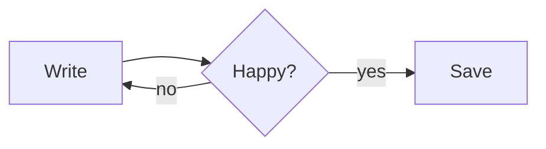
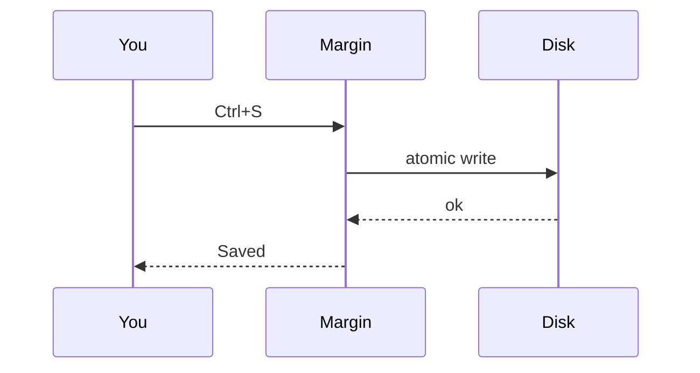

# Welcome to Margin
Hello World

Margin is a calm Markdown editor. Syntax fades away as you write and comes back **only on the line you're editing**. Try moving the cursor through this paragraph: *emphasis*, `inline code`, ~~strikethrough~~ and [links](https://tauri.app) all reveal their Markdown when you touch them.

## Headings live in the margin

Every heading gets a quiet label to its left, so you always know where you are in the structure.

### Lists and tasks

- Bullets render as dots
- Nested lists work too
  - Like this one
    - And this one
1. Numbered lists
2. Stay numbered

- [x] Checkboxes are clickable
- [ ] Or toggle them with Ctrl+Enter

> Blockquotes get a soft rule on the left.
> They can span several lines.

---

## Diagrams

Mermaid code blocks render as diagrams. Click one to edit its source; the preview updates live underneath.





## Code

```rust
fn main() {
    let greeting = "hello";
    println!("{greeting}, margin!");
}
```

## Tables

| Shortcut | Action |
| --- | --- |
| `Ctrl+B` / `Ctrl+I` | Bold / italic |
| `Ctrl+1`…`Ctrl+6` | Heading level |
| `Ctrl+/` | Toggle source mode |
| `Ctrl+Shift+M` | Insert a diagram |
